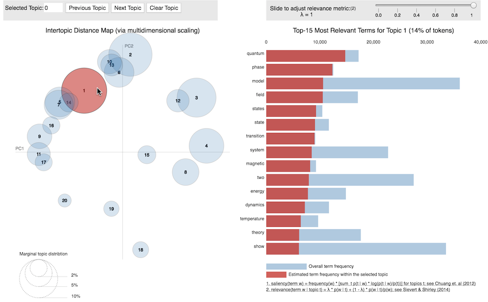

# LDA on some arxiv data


## To run the notebook

Complete the following:

```bash
# download .zip file containing text data
wget https://www.dropbox.com/s/h7u8thivlly8a2k/Arxiv_text_data.zip

# unzip
unzip Arxiv_text_data.zip
```
Run the `join_files.py` script to join all the JSON files together and save as `.csv`

```bash
# python join_files.py --load_directory {directory_of_jsonfiles} --save_as {result_file_name}

python join_files.py --load_directory /home/ubuntu/Arxiv_text_data/data --save_as text_data.csv
```

Now feel free to run the Jupyter Notebook, just make sure to change the file path of the csv file



